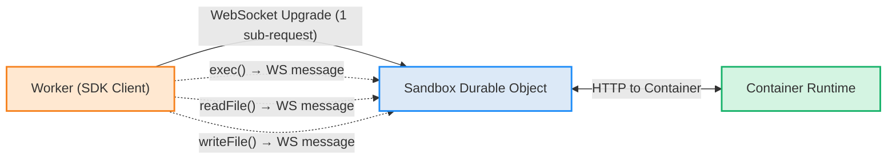

WebSocket transport is an alternative communication method between the Sandbox SDK client and container runtime that reduces sub-request count by multiplexing multiple operations over a single WebSocket connection.

## Why use WebSocket transport

When using HTTP transport (the default), each SDK operation (like `exec()`, `readFile()`, `writeFile()`) creates a separate HTTP request. In Workers and Durable Objects, these requests count against [sub-request limits](/workers/platform/limits/#subrequests).

WebSocket transport solves this by:

- **Multiplexing requests** - Send many operations over one WebSocket connection
- **Reducing sub-request count** - Only the initial WebSocket upgrade counts as a sub-request
- **Maintaining compatibility** - Works with all existing SDK methods without code changes

## When to use WebSocket transport

Consider WebSocket transport when:

- **High operation volume** - Your Worker performs many sandbox operations per request
- **Near sub-request limits** - You are approaching Workers sub-request limits
- **Long-lived interactions** - Your code performs sequences of operations on the same sandbox

Continue using HTTP transport (default) when:

- **Simple use cases** - You perform only a few operations per request
- **No sub-request concerns** - Your Worker is well under sub-request limits
- **Maximum compatibility** - You want to use the most battle-tested transport

## How it works

### Architecture



### Protocol

The WebSocket transport implements a request-response protocol:

1. **Client sends WSRequest** with unique ID, method, path, and body
2. **Server sends WSResponse** with matching ID, status, and body
3. **Streaming support** - For streaming operations, server sends multiple WSStreamChunk messages before final WSResponse

All messages are JSON-encoded. The protocol maintains compatibility with existing HTTP-based handlers - the container runtime routes WebSocket messages through the same HTTP handlers used for direct HTTP requests.

## Enable WebSocket transport

WebSocket transport is automatically available in the SDK. Enable it by passing `useWebSocket: true` when creating a sandbox:

```typescript
import { getSandbox } from "@cloudflare/sandbox";

export default {
  async fetch(request: Request, env: Env): Promise<Response> {
    // Enable WebSocket transport
    const sandbox = getSandbox(env.Sandbox, "my-sandbox", {
      useWebSocket: true
    });

    // All operations now use WebSocket transport
    await sandbox.exec("echo 'Hello via WebSocket'");
    await sandbox.writeFile("/workspace/data.txt", "content");
    const content = await sandbox.readFile("/workspace/data.txt");

    // Only the initial WebSocket upgrade counted as a sub-request
    return Response.json({ success: true });
  }
};
```

## Performance characteristics

### Connection lifecycle

- **First operation** - Establishes WebSocket connection (counts as 1 sub-request)
- **Subsequent operations** - Reuse existing connection (no additional sub-requests)
- **Connection pooling** - The SDK maintains the connection for the lifetime of the sandbox instance
- **Automatic reconnection** - If connection drops, SDK transparently reconnects

### Latency considerations

- **First request** - Slightly higher latency due to WebSocket upgrade handshake
- **Subsequent requests** - Similar latency to HTTP transport
- **Streaming operations** - WebSocket transport converts Server-Sent Events (SSE) to WebSocket messages

### Best practices

**Use WebSocket transport when:**

```typescript
// High operation count per request
const sandbox = getSandbox(env.Sandbox, "batch-processor", {
  useWebSocket: true
});

for (let i = 0; i < 100; i++) {
  await sandbox.exec(`process-item-${i}.sh`);
}
// Only 1 sub-request instead of 100
```

**Stick with HTTP transport when:**

```typescript
// Single operation per request
const sandbox = getSandbox(env.Sandbox, "simple-exec");
await sandbox.exec("single-command.sh");
// 1 sub-request either way, HTTP is simpler
```

## Implementation details

### Message types

The WebSocket protocol defines four message types:

- **WSRequest** - Client to server request with method, path, and body
- **WSResponse** - Server to client response with status and body
- **WSStreamChunk** - Server to client streaming data chunk
- **WSError** - Server to client error message

### Streaming support

For streaming operations like `execStream()`:

1. Client sends WSRequest for streaming endpoint
2. Server responds with multiple WSStreamChunk messages (converted from SSE format)
3. Server sends final WSResponse when stream completes

This maintains compatibility with existing streaming code while using WebSocket transport.

### Error handling

WebSocket transport handles errors at multiple levels:

- **Connection errors** - Automatic reconnection with exponential backoff
- **Request errors** - Returned as WSError messages with error codes
- **Timeout handling** - Configurable timeouts for connection and requests

## Compatibility

WebSocket transport is fully compatible with:

- All SDK methods (exec, files, processes, ports, etc.)
- Streaming operations (execStream, readStream)
- Session management
- Preview URLs and port forwarding
- Code Interpreter API

No code changes are required to existing SDK usage - simply enable the option and all operations transparently use WebSocket transport.

## Limitations

- **Workers and Durable Objects only** - WebSocket transport is designed for environments with sub-request limits
- **Not for external services** - This is for SDK-to-container communication only, not for [WebSocket connections to services inside sandboxes](/sandbox/guides/websocket-connections/)
- **Durable Object WebSocket limits apply** - Standard Durable Object WebSocket limits and quotas apply

## Related resources

- [Architecture concept](/sandbox/concepts/architecture/) - Overview of SDK architecture
- [Sandbox options](/sandbox/configuration/sandbox-options/) - Configuration options for sandboxes
- [Workers limits](/workers/platform/limits/) - Workers sub-request limits and quotas
- [WebSocket connections to sandboxes](/sandbox/guides/websocket-connections/) - Connect to WebSocket servers inside sandboxes
